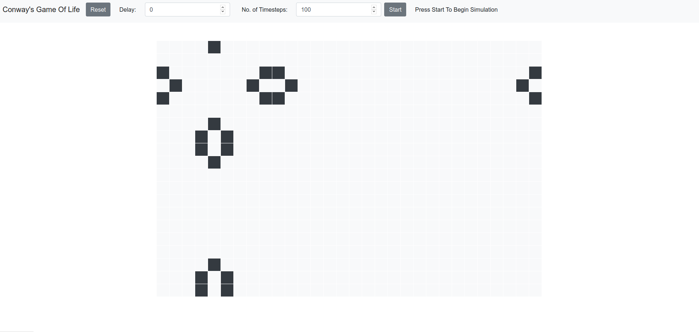

# Conway's Game Of Life

#### A very naive implementation of Conway's Game of Life using ReactJS framework.

Contains a 20 x 30 grid where the user can select the pattern (after pressing the Reset button), and specify the Number of Timesteps and the Delay between each timestep. Implemented with wrap-around (e.g.- pattern from the bottom comes to top).

### `npm start`

Runs the app in the development mode. 
Open [http://localhost:3000](http://localhost:3000) to view it in the browser.

The page will reload if you make edits. 
You will also see any lint errors in the console.
